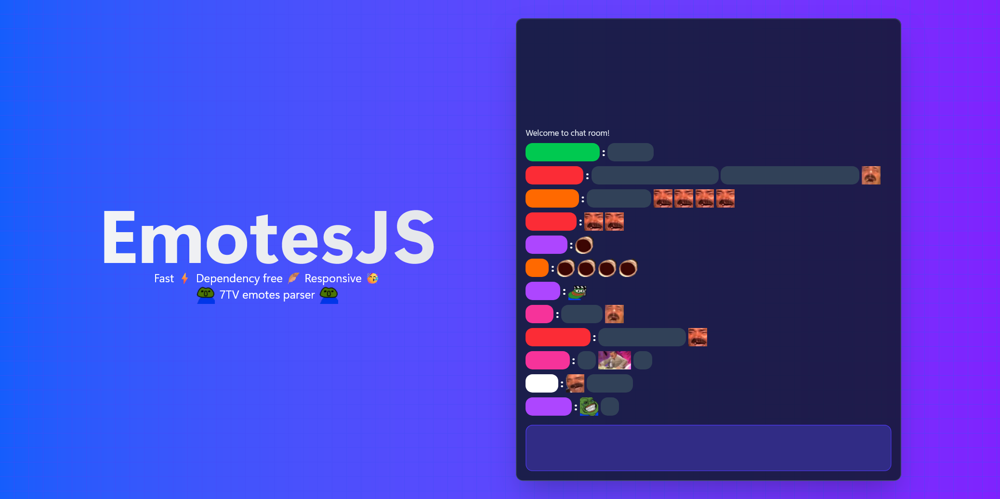

 

# EmotesJS

Fast, dependency free, and responsive 7TV inline emotes parse

## Usage

### Installation
```sh
pnpm i emotesjs
```
or using a CDN
```html
<script src="https://cdn.jsdelivr.net/npm/emotesjs@0.0.21/index.min.js"></script>
```

### Parsing
```js
// const { EmotesJS } = require('emotesjs')
import { EmotesJS } from 'emotesjs'

let emotes = new EmotesJS({ channelId: 123456 })

// optional - once fetched, the emotes will be cached in memory
await emotes.isLoading

let html = emotes.parse('this is pretty Pog')

console.log(html) 
// this is pretty 
```

## Configuration

```js
new EmotesJS({ 
    channelId: 123456, // twitch channel id (or user id) to load the emotes
    colon: false, // if true, the string must start with : e.g. :Pog
    height: '1.65rem', // the element  height
    format: 'WEBP' // or AVIF
})
```
