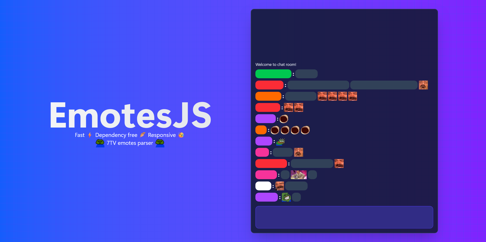

 

# EmotesJS

Fast, dependency free, and responsive 7TV inline emotes parse

## Basic usage

```sh
npm i emotesjs
```

```ts
import { EmotesJS } from 'emotesjs'

let emotes = new EmotesJS({ channelId: 123456 })

let html = emotes.parse('this is pretty Pog')

console.log(html) 
// this is pretty 
```

[Check the documentation here](https://darckfast.com/docs/emotesjs)
